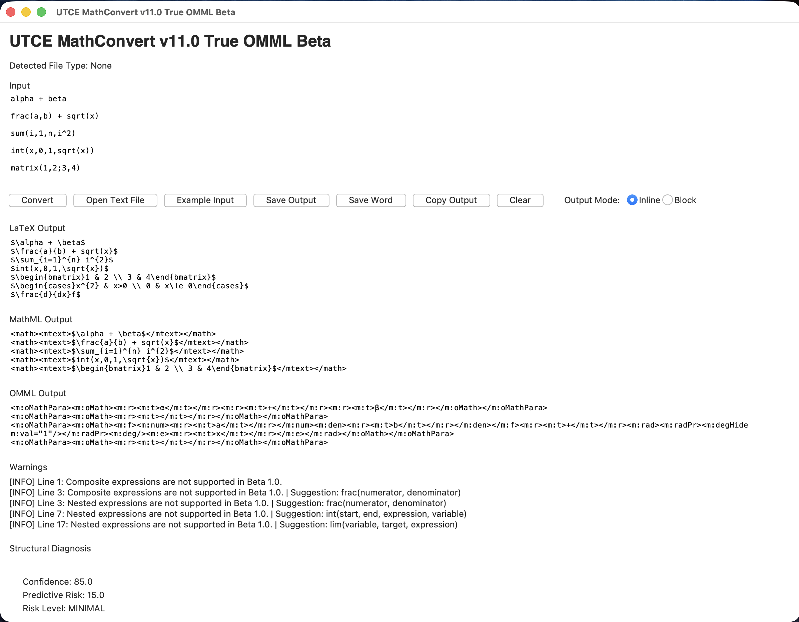
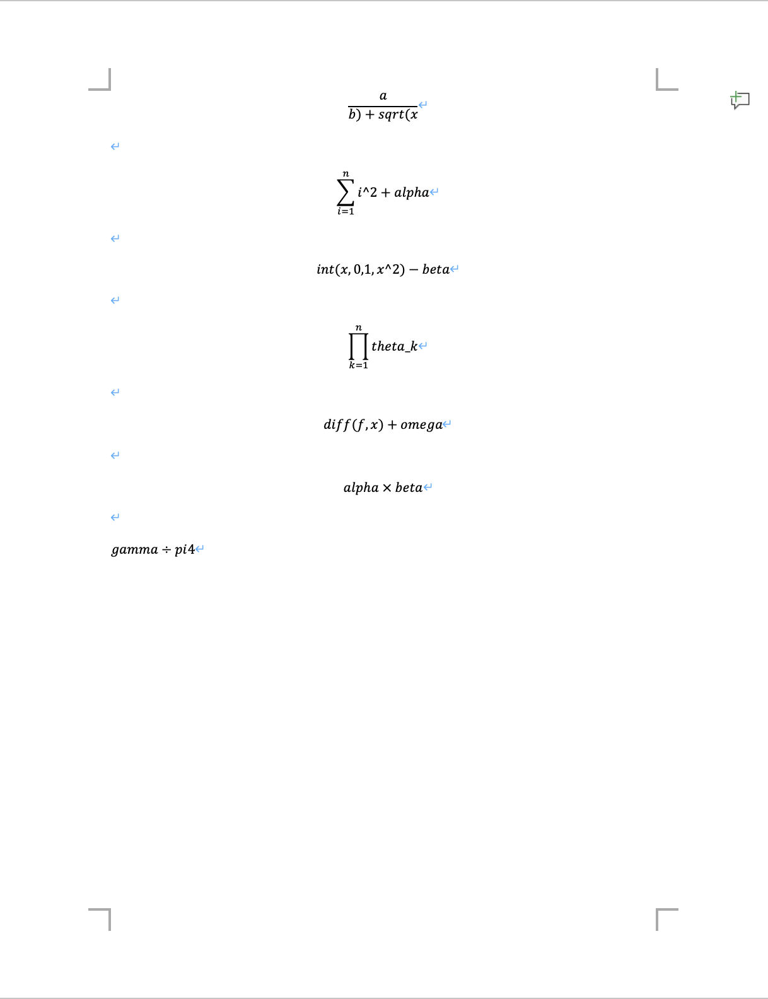
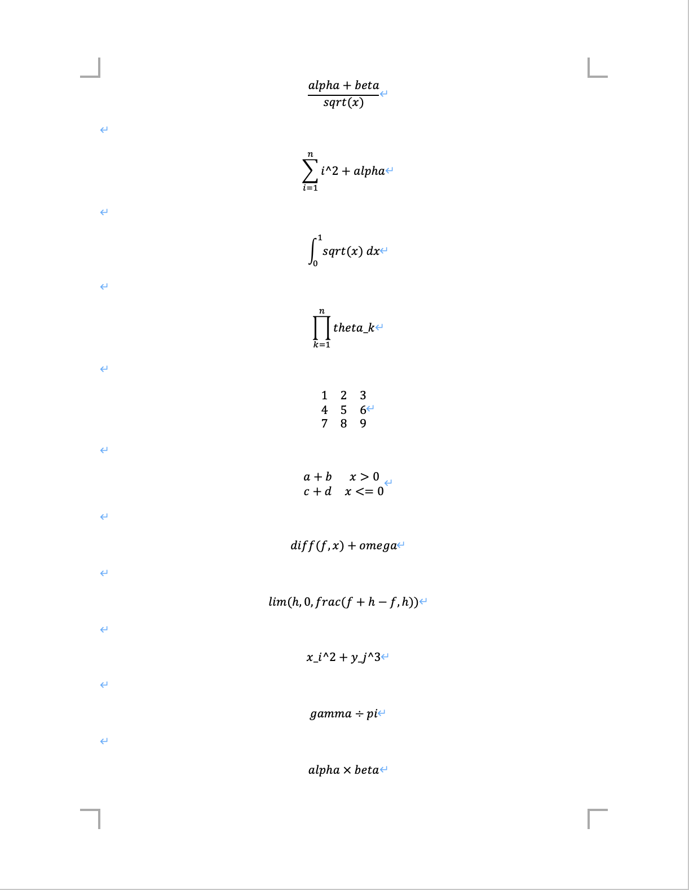
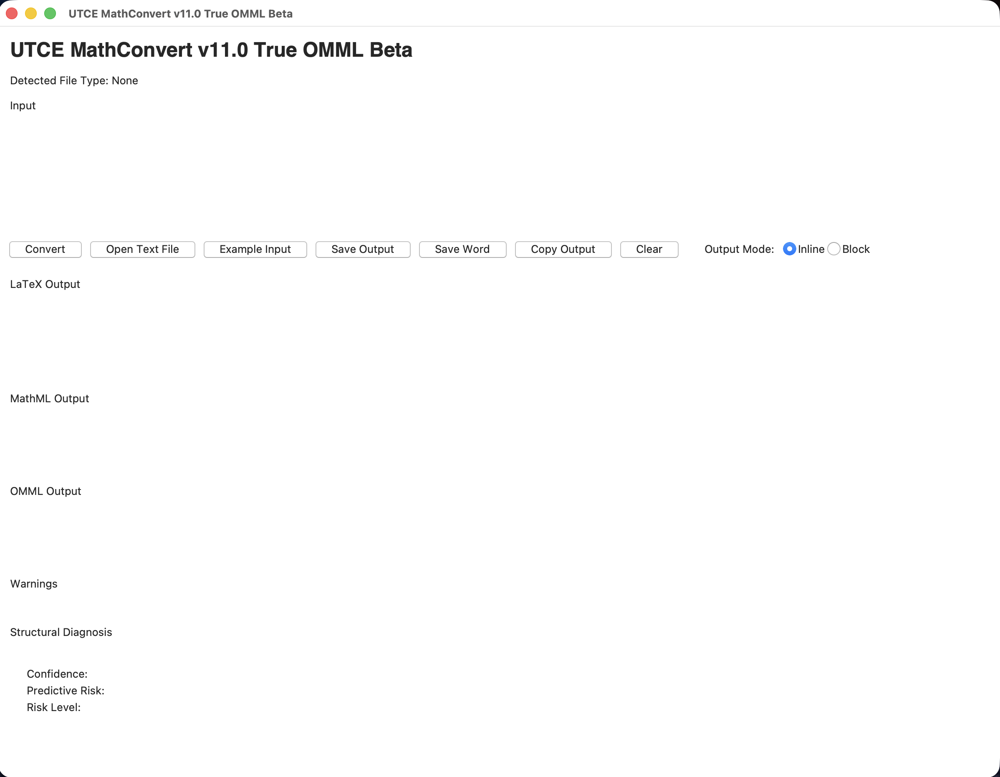

# UTCE MathConvert Free Beta 1.0

UTCE MathConvert is a plain-math to LaTeX / MathML / Word OMML converter.

## Main Features

- Greek symbols
- Fractions
- Square roots
- Superscripts
- Subscripts
- Summation
- Product
- Integral
- Derivative
- Limit
- Matrix
- Cases
- Basic operators (+ − × ÷)
- Native Word equation (.docx) export

## Recommended Use

- Reports
- Undergraduate theses
- Graduate reports
- Office documents
- Academic drafts

## Known Limitations

- Nested expressions are partially supported.
- Very complex formulas may not render correctly.
- Operator precedence is still under development.
- Beta version: please verify output before important use.

## Outputs

- LaTeX
- MathML
- True OMML
- Word .docx with native equations

## Version

Free Beta 1.0

Future:

- v1.1 Recursive nesting
- v2.0 Full parser engine

# UTCE-MathConvert

Plain Math → Word OMML Converter

---

## Main Window

---

## Word Output

---

## Complex Formula Example

---

## Application Icon

---

## Features

- Greek symbols
- Fractions
- Square roots
- Superscripts
- Subscripts
- Summation
- Product
- Integral
- Limits
- Matrix
- Cases
- Derivatives
- + − × ÷ operators
- Native Word OMML output

---

## Outputs

- LaTeX
- MathML
- Word OMML
- .docx with native equations

---

## Platform

macOS (Apple Silicon)

---

## Author

Yuichi Fujiki

---

## License

MIT License